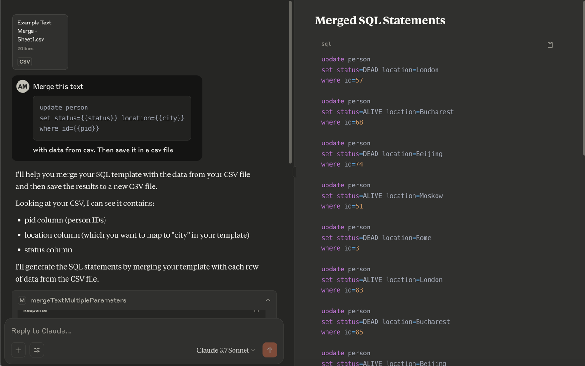

Text Merge MCP Server
=============
This is a mcp server that combine parameterized text (mustache format) with multiple arguments.

## Requirements
- Java 21
- Maven

## Build
- clone this repo
- run `./mvnw install`

## Configuration
```json
{
  "mcpServers": {
    "text-merge": {
      "command": "java",
      "args": [
        "-jar",
        "~/.m2/repository/id/mahaat/mustache-tool/1.0.0-SNAPSHOT/mustache-tool-1.0.0-SNAPSHOT-runner.jar"
      ]
    }
  }
}
```


## Usage
For example, we need to parameterized this query text
```sql
update person
set status={{status}} location={{city}}
where id={{pid}}
```
with multiple data

We can use this prompt
```
Merge this text

update person
set status={{status}} location={{city}}
where id={{pid}}

with data from csv. Then save it in a csv file
```

